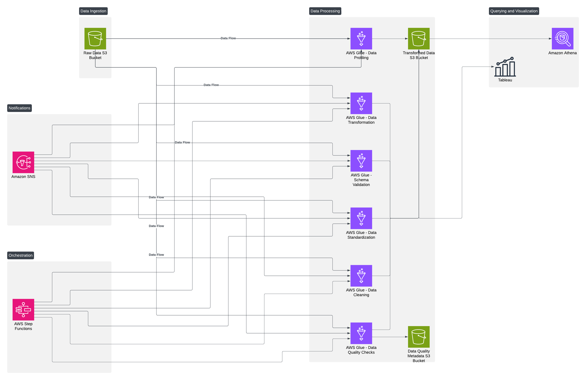

# Last Mile Connectivity
Addressing last mile connectivity for public transport using  - WMATA (Washington Metropolitan Area Transit Authority) Ridership Data, Capital Bikeshare Trip History Data, US Census Bureau Data and Transit App. AWS services were used for data storage, processing, and querying.

---

## Architecture 

## Data Sources

### 1. **Transit API**
#### How We Acquired It:
- Requested academic access via [Transit API Request Form](https://forms.gle/4pNBfCRtvkGtNhDz5).
- Acquired an API key through academic partnership.

#### APIs Used:
- `/public/nearby_route`: Lists transit routes near a specific location.
- `/public/nearby_stops`: Provides details of transit stops within proximity of a point.
- `/map_layers/placemarks`: Retrieves data on shared systems like bikeshare docks and scooters.

#### Why We Acquired It:
- To identify transit options near bikeshare stations.
- To highlight areas lacking seamless multimodal connectivity.

#### Data Processing:
- JSON outputs were converted into CSV format.
- Data was stored in an AWS S3 bucket for further cleaning and analysis.

#### Screenshots:
- **Transit API Sample JSON Output**: 
- **Converted CSV File Example**: 

---

### 2. **U.S. Census Data**
#### How We Acquired It:
- Accessed publicly available data from the Census Data Portal.

#### What We Acquired:
- **Total Population**: Breakdown by gender.
- **Disability Distribution**: Percentages of people with disabilities.
- **Employment Distribution**: Employment rates by region.
- **Commute Preferences**: Modes of transportation used for commuting.
- **Vehicle Ownership**: Households owning vehicles.
- **School Enrollment**: School-age population data.

#### Why We Acquired It:
- To assess socioeconomic factors influencing transit needs.
- To evaluate regions with potential demand for better connectivity solutions.

#### Screenshots:
- **Sample Census Data**: 

---

### 3. **Capital Bikeshare Data**
#### How We Acquired It:
- Downloaded monthly CSV files from the [Capital Bikeshare System Data portal](https://www.capitalbikeshare.com/system-data).

#### What We Acquired:
- **Start and End Stations**: Location details.
- **Trip Duration**: Total time for each ride.
- **User Type**: Member vs. Casual riders.
- **Bike ID**: Unique identifiers for bikes.

#### Why We Acquired It:
- To analyze station usage patterns.
- To identify high-demand areas for last-mile connectivity improvements.

#### Screenshots:
- **Sample Bikeshare CSV Data**: 

---

### 4. **WMATA Data**
#### How We Acquired It:
- Retrieved data from the [WMATA Ridership Portal](https://www.wmata.com/).

#### What We Acquired:
- **Average Daily Ridership by Rail Station**: Passenger counts for rail stations.
- **Average Daily Ridership by Route**: Passenger counts for bus and rail routes.

#### Why We Acquired It:
- To identify high-ridership stations or routes with potential connectivity issues.
- To correlate ridership data with bikeshare and Census data for planning interventions.

#### Screenshots:
- **WMATA Data Portal Screenshot**: 

---

## Locations Considered
- **Top 20 hubs in the DMV region**:
  - Washington, DC
  - Bethesda, MD
  - Silver Spring, MD
  - Arlington, VA
  - Alexandria, VA
  - Rockville, MD
  - Gaithersburg, MD
  - Tysons, VA
  - Fairfax, VA
  - McLean, VA
  - Falls Church, VA
  - Vienna, VA
  - College Park, MD
  - Greenbelt, MD
  - Hyattsville, MD
  - Laurel, MD
  - Bowie, MD
  - Chantilly, VA
  - Reston, VA
  - Manassas, VA

---

## AWS Services Used

### **1. AWS S3**
#### Purpose:
- Centralized storage for raw, transformed, and processed datasets.

#### Directory Structure:
- `/raw`: Contains raw data.
- `/transformed`: Contains cleaned and transformed data.
- `/athena`: Contains Athena query results.

#### Screenshots:
- **S3 Directory Structure**: 

---

### **2. AWS Glue**
#### AWS Crawlers:
- Created to generate data schemas for all datasets.
- Example Crawler: `shared-mobility-crawler`.
- Example Schema: `shared_mobility`.

#### AWS Glue Jobs:
- Designed for extracting, cleaning, and transforming datasets.
- Example Jobs:
  - `transform-transit-api-data`.
  - `clean-capital-bikeshare-data`.
  - `merge-wmata-census-data`.
- **Rulesets**: Defined to standardize transformation pipelines.

#### Screenshots:
- **AWS Glue Crawlers**: 
- **AWS Glue Job Example**: 

---

### **3. AWS Athena**
- Used to query transformed datasets stored in S3.

#### Example Query:

