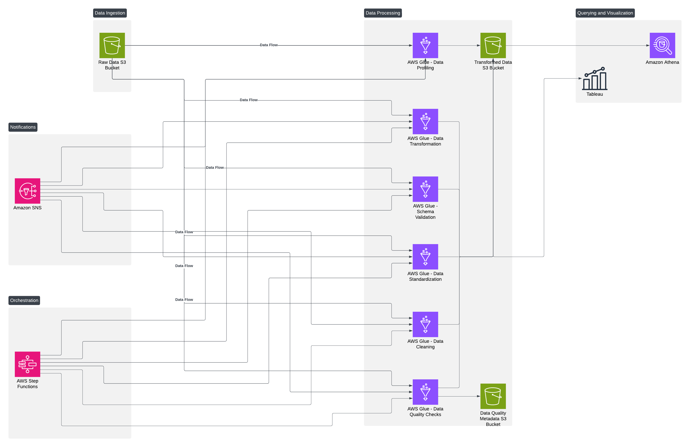

---

# Last Mile Connectivity in the DMV Region

## Overview
This project focuses on addressing the **last-mile connectivity problem** in the Washington, D.C., Maryland, and Virginia (DMV) region by leveraging various datasets, including **WMATA (Washington Metropolitan Area Transit Authority) Ridership Data**, **Capital Bikeshare Trip History Data**, **U.S. Census Bureau Data**, and the **Transit App API**. The goal is to identify gaps in multimodal transportation options and propose solutions to improve public transport accessibility.

---

## Index

1. [Introduction](#introduction)
2. [Objectives](#objectives)
3. [Problem Statement](#problem-statement)
4. [Locations Considered](#locations-considered)
5. [Data Sources](#data-sources)
6. [Data Acquisition and Transformation](#data-acquisition-and-transformation)
7. [Data Integration and Model](#data-integration-and-model)
8. [Technology Stack and Architecture](#technology-stack-and-architecture)
9. [Data Visualization](#data-visualization)
10. [Athena Queries](#athena-queries)
11. [Insights and Recommendations](#insights-and-recommendations)
12. [Challenges and Lessons Learned](#challenges-and-lessons-learned)
13. [Conclusion and Future Enhancements](#conclusion-and-future-enhancements)
14. [References](#references)
15. [Important Links](#important-links)

---

## Introduction
The **"last-mile" connectivity problem** refers to the challenges commuters face in reaching their final destinations from public transit stops. This project aims to address these issues in the DMV region by analyzing ridership patterns, bike-share usage, and demographic factors to propose actionable solutions.

---

## Objectives
- **Data Integration**: Combine multiple data sources to understand last-mile connectivity challenges comprehensively.
- **Gap Identification**: Pinpoint specific areas with insufficient transit and bikeshare infrastructure.
- **Recommendations**: Develop feasible solutions to bridge connectivity gaps.

---

## Problem Statement
Public transportation in the DMV region faces significant last-mile challenges, resulting in:
- Reduced transit system utilization.
- Increased dependency on private vehicles.
- Inequities in accessibility for underserved communities.

---

## Locations Considered
Key locations analyzed in the DMV region include:
- **Washington, D.C.**
- **Bethesda, MD**
- **Silver Spring, MD**
- **Arlington, VA**
- **Alexandria, VA**
- **Rockville, MD**
- **Gaithersburg, MD**
- **Tysons, VA**
- **Fairfax, VA**
- **McLean, VA**
- **Falls Church, VA**
- **Vienna, VA**
- **College Park, MD**
- **Greenbelt, MD**
- **Hyattsville, MD**
- **Laurel, MD**
- **Bowie, MD**
- **Chantilly, VA**
- **Reston, VA**
- **Manassas, VA**

---

## Data Sources
1. **WMATA Ridership Data**: Provides insights into public transit usage.
2. **Capital Bikeshare Data**: Highlights bike-share trends and station demands.
3. **U.S. Census Bureau Data**: Offers demographic and socioeconomic context.
4. **Transit App API**: Supplies real-time transit data and stop information.

---

## Data Acquisition and Transformation

### 1. **Capital Bikeshare Data**
- **Acquisition**: Monthly CSV files downloaded from the [Capital Bikeshare System Data portal](https://www.capitalbikeshare.com/system-data).
- **Purpose**: Analyze trip patterns and identify high-demand areas for bike-sharing.
- **Data Content**: Includes start/end stations, trip durations, and user types.

### 2. **Transit API Data**
- **Acquisition**: Accessed via the Transit API, providing real-time data on transit routes and stops.
- **Purpose**: Evaluate the proximity of transit options to bikeshare stations and identify underserved regions.
  
### 3. **U.S. Census Bureau Data**
- **Acquisition**: Public data from the U.S. Census Data Portal.
- **Purpose**: Analyze socio-economic and demographic factors to assess public transportation needs.
  
### 4. **WMATA Ridership Data**
- **Acquisition**: Open data from the [WMATA Ridership Portal](https://www.wmata.com/).
- **Purpose**: Analyze ridership data to identify high-traffic areas and assess connectivity gaps.

---

## Data Integration and Model
The datasets were integrated to create a comprehensive view of last-mile connectivity. Key steps involved geospatial analysis, data mapping, and combining datasets to identify proximity and demand patterns.

**Target Data Model:**
- **Bus WMATA**: Includes average ridership for different routes.
- **Metro WMATA**: Contains data on metro stations and ridership.
- **Nearby Stops**: Information on nearby transit stops.
- **Shared Mobility**: Data on bikeshare stations and their bike counts.
- **US Census**: Demographic breakdowns including commuting preferences and vehicle ownership.
- **Capital Bikeshare**: Information on trips, stations, and user types.

---

## Technology Stack and Architecture



- **AWS S3**: Storage for raw and transformed data.
- **AWS Glue**: ETL processes for data cleaning and transformation.
- **AWS Athena**: Serverless querying of integrated datasets.
- **AWS QuickSight**: Data visualization and dashboard creation.

---

## Data Visualization

### Athena Queries

#### Popular Bike Sharing Routes:
```sql
SELECT start_station_name, end_station_name, COUNT(ride_id) AS ride_count
FROM capital_bikeshare
WHERE start_station_name != ''
    AND end_station_name != ''
GROUP BY start_station_name, end_station_name
ORDER BY ride_count DESC;
```

#### Average Weekday Bus Ridership:
```sql
SELECT route, "average of weekday", "average of saturday", "average of sunday"
FROM bus_wmata
ORDER BY "average of weekday" DESC;
```

#### Average Daily Ridership in Metro:
```sql
SELECT "station name", 
       AVG("avg daily tapped entries") AS avg_tapped_entries,
       AVG("avg daily nontapped entries") AS avg_nontapped_entries
FROM metro_wmata
GROUP BY "station name";
```

#### Availability of Bikes and E-Bikes:
```sql
SELECT location, sum(bike_count) as bike_count, sum(electric_bike_count) as electric_bike_count
FROM shared_mobility
GROUP BY location
ORDER BY bike_count DESC, electric_bike_count DESC;
```

#### Proximity Analysis Based on Shared Mobility and Nearby Routes:
```sql
SELECT nr.route_short_name, nr.location, sm.location, sum(sm.bike_count) as bike_count
FROM nearby_routes nr
JOIN shared_mobility sm 
  ON ST_Distance(ST_Point(nr.longitudes, nr.latitudes), ST_Point(sm.longitude, sm.latitude)) < 1000  
GROUP BY 1,2,3
ORDER BY 4 DESC;
```

#### Proximity Analysis Based on Shared Mobility and Metro Stations:
```sql
SELECT ns.stop_name, ns.location_name, sm.location, sum(sm.bike_count) as bike_count
FROM nearby_stops ns
JOIN shared_mobility sm 
  ON ST_Distance(ST_Point(ns.stop_lat, ns.stop_lon), ST_Point(sm.longitude, sm.latitude)) < 1000  
GROUP BY 1,2,3
ORDER BY 4 DESC;
```

#### Demography Analysis About Travel Methods:
```sql
SELECT distinct REPLACE(label, '"','' ) as county_name,
       max("drove alone") as "drove alone",
       max("carpooled") as "carpooled",
       max("employed population") as "employed population",
       max("18 to 34 years") as "18 to 34 years",
       max("35 to 64 years") as "35 to 64 years",
       max("65 years and over") as "65 years and over"
FROM us_census
WHERE level = 'County'
GROUP BY 1
ORDER BY 2 DESC;
```

#### Overall Proximity Analysis:
```sql
SELECT ns.*, sm.*
FROM "AwsDataCatalog"."lastmile-db"."nearby_stops" ns
JOIN "AwsDataCatalog"."lastmile-db"."shared_mobility" sm 
  ON ST_Distance(ST_Point(ns.stop_lat, ns.stop_lon), ST_Point(sm.longitude, sm.latitude)) < 1000;
```

---

## Insights and Recommendations

### Key Insights:
- **Ridership Gaps**: Areas like **Rockville** lack sufficient bikeshare stations.
- **High-Demand Areas**: Metro stations in **D.C.** and **Maryland** could benefit from more bike-share allocations.

### Recommendations:
- Expand bikeshare stations in underserved areas.
- Improve coordination between bikeshare stations and metro stops.
- Optimize bike allocations at high-demand metro stations.

---

## Challenges and Lessons Learned
- **Challenges**: Addressing inconsistencies and missing data, managing AWS costs.
- **Lessons Learned**: Gained proficiency with AWS tools, improved collaboration.

---

## Conclusion and Future Enhancements
- Developed a scalable data pipeline and delivered actionable insights.
- **Future Enhancements**:
  - Integrating machine learning models for predictive analysis.
  - Transitioning to AWS Redshift for persistent data storage.

---

## References
- [WMATA Open Data Hub: WMATA Ridership Data](https://www.wmata.com/)
- [Capital Bikeshare System Data](https://www.capitalbikeshare.com/system-data)
- [U.S. Census Bureau](https://www.census.gov/data)
- [Transit App API](https://transitapp.com/)

---

## Important Links
- All code and data are available in the GitHub repository.
- Presentation Slides

---
